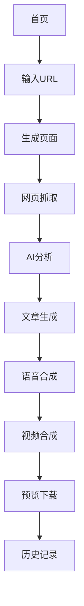

## 1. 产品概述

AutoRead 是一个智能网页内容转视频工具，用户只需输入网页地址，系统即可自动抓取网页内容，通过AI分析生成约1000字的核心文章，并将其转换为配有语音解说的视频内容。

该产品解决了内容创作者、教育工作者和营销人员将网页内容快速转化为视频内容的需求，大幅提升内容制作效率。

## 2. 核心功能

### 2.1 用户角色

| 角色 | 注册方式 | 核心权限 |
|------|----------|----------|
| 普通用户 | 邮箱注册 | 提交网页URL、查看生成历史、下载文章和视频 |
| 访客用户 | 无需注册 | 提交网页URL、查看生成结果（限时保存） |

### 2.2 功能模块

AutoRead 包含以下核心页面：

1. **首页**: URL输入框、功能介绍、示例展示
2. **生成页面**: 进度显示、预览功能、下载选项
3. **历史记录页面**: 过往生成记录、重新生成、批量管理

### 2.3 页面详情

| 页面名称 | 模块名称 | 功能描述 |
|----------|----------|----------|
| 首页 | URL输入区域 | 接收用户输入的网页地址，支持粘贴和拖拽 |
| 首页 | 功能介绍 | 展示产品特色和使用流程 |
| 首页 | 示例展示 | 提供成功案例和生成效果预览 |
| 生成页面 | 进度显示 | 实时显示抓取、分析、生成、转视频的进度 |
| 生成页面 | 文章预览 | 展示AI生成的约1000字文章内容 |
| 生成页面 | 视频预览 | 提供生成的视频播放和预览功能 |
| 生成页面 | 下载选项 | 支持单独下载文章或视频文件 |
| 历史记录 | 记录列表 | 显示用户所有生成历史 |
| 历史记录 | 重新生成 | 允许对历史记录重新处理 |
| 历史记录 | 批量管理 | 支持批量删除和导出 |

## 3. 核心流程

用户操作流程如下：

1. 用户在首页输入网页URL并提交
2. 系统开始抓取网页内容并显示进度
3. AI分析网页结构，提取章节和核心内容
4. 生成约1000字的文章内容
5. 将文章内容转换为语音（使用EdgeTTS）
6. 截取网页章节截图作为视频画面
7. 合成音视频生成最终视频文件
8. 用户可预览、下载文章和视频

## 4. 用户界面设计

### 4.1 设计风格

- **主色调**: 深蓝色 (#1E3A8A) 搭配白色背景
- **辅助色**: 浅灰色 (#F3F4F6) 用于卡片和分隔
- **按钮样式**: 圆角矩形，主要按钮使用渐变色
- **字体**: 中文使用思源黑体，英文使用Inter
- **布局风格**: 卡片式布局，顶部导航栏
- **图标风格**: 使用简洁的线性图标

### 4.2 页面设计概览

| 页面名称 | 模块名称 | UI元素 |
|----------|----------|--------|
| 首页 | URL输入区域 | 大号输入框，圆角边框，占位符提示，提交按钮为蓝色渐变 |
| 首页 | 功能介绍 | 三栏卡片布局，图标+标题+描述，浅灰色背景 |
| 生成页面 | 进度显示 | 进度条带百分比，步骤卡片高亮当前状态 |
| 生成页面 | 文章预览 | 白色卡片，黑色文字，行间距1.6，支持展开收起 |
| 生成页面 | 视频预览 | 16:9视频播放器，底部控制栏，支持全屏 |
| 历史记录 | 记录列表 | 表格形式，包含时间、URL、状态、操作按钮 |

### 4.3 响应式设计

采用桌面优先设计，适配移动端：
- 桌面端：最大宽度1200px，左右留白
- 平板端：768px-1024px，两栏布局
- 移动端：<768px，单栏布局，底部导航

### 4.4 交互优化

- 输入框支持URL自动格式化
- 进度条平滑动画过渡
- 按钮悬停效果（轻微放大+阴影）
- 加载状态使用骨架屏
- 错误提示使用友好的toast通知