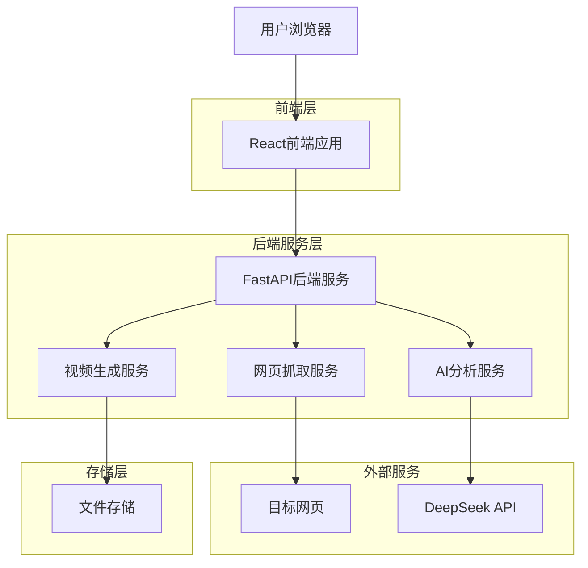
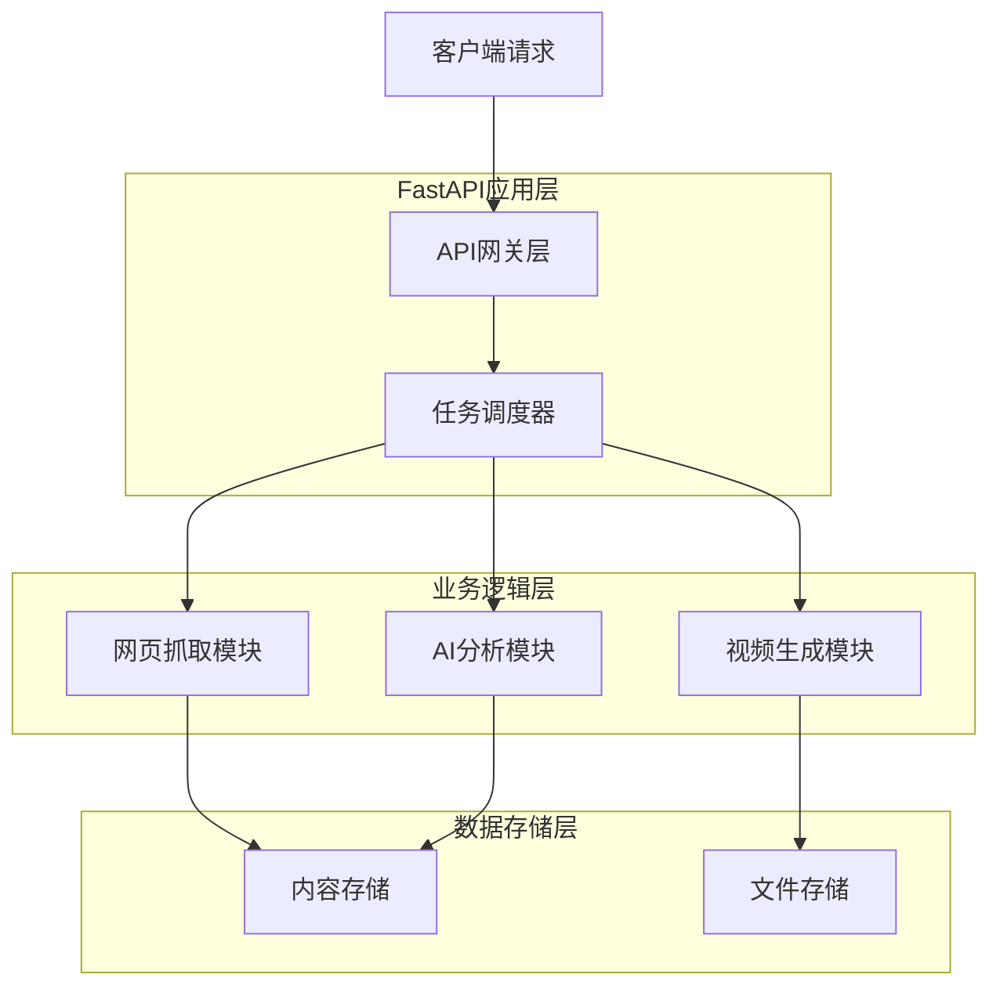
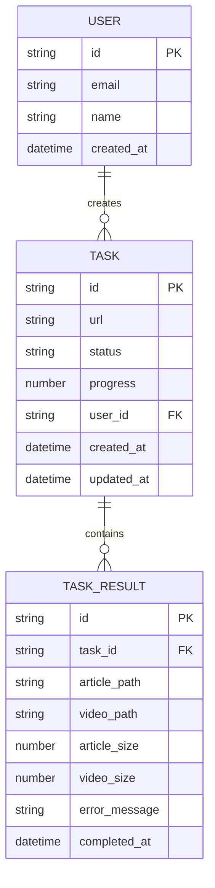

## 1. 架构设计



## 2. 技术栈描述

- **前端**: React@18 + TypeScript + TailwindCSS@3 + Vite
- **初始化工具**: vite-init
- **后端**: FastAPI (Python)
- **网页抓取**: Playwright + BeautifulSoup4
- **AI服务**: DeepSeek API (或其他兼容API)
- **语音合成**: EdgeTTS
- **视频生成**: MoviePy
- **文件存储**: 本地文件系统（可扩展至云存储）

## 3. 路由定义

| 路由 | 用途 |
|------|------|
| / | 首页，URL输入和功能介绍 |
| /generate | 生成页面，显示进度和结果 |
| /history | 历史记录页面 |
| /api/process | 处理URL的后端API端点 |
| /api/status/{task_id} | 查询任务状态 |
| /api/download/{type}/{task_id} | 下载文章或视频 |

## 4. API定义

### 4.1 核心API

**提交URL处理任务**
```
POST /api/process
```

请求参数：
| 参数名 | 参数类型 | 是否必需 | 描述 |
|--------|----------|----------|------|
| url | string | true | 目标网页URL |
| user_id | string | false | 用户ID（可选） |

响应：
| 参数名 | 参数类型 | 描述 |
|--------|----------|------|
| task_id | string | 任务唯一标识 |
| status | string | 任务状态（pending/processing/completed/failed） |
| message | string | 状态描述信息 |

示例：
```json
{
  "url": "https://example.com/article",
  "user_id": "user123"
}
```

**查询任务状态**
```
GET /api/status/{task_id}
```

响应：
| 参数名 | 参数类型 | 描述 |
|--------|----------|------|
| task_id | string | 任务ID |
| status | string | 当前状态 |
| progress | number | 进度百分比 |
| article_url | string | 生成文章的下载链接 |
| video_url | string | 生成视频的下载链接 |
| error | string | 错误信息（如果有） |

**下载文件**
```
GET /api/download/{type}/{task_id}
```

参数：
| 参数名 | 参数类型 | 描述 |
|--------|----------|------|
| type | string | 文件类型（article/video） |
| task_id | string | 任务ID |

## 5. 服务器架构图



## 6. 数据模型

### 6.1 数据模型定义



### 6.2 数据定义语言

**任务表 (tasks)**
```sql
-- 创建任务表
CREATE TABLE tasks (
    id VARCHAR(36) PRIMARY KEY DEFAULT (UUID()),
    url VARCHAR(2048) NOT NULL,
    status VARCHAR(20) DEFAULT 'pending' CHECK (status IN ('pending', 'processing', 'completed', 'failed')),
    progress INTEGER DEFAULT 0 CHECK (progress >= 0 AND progress <= 100),
    user_id VARCHAR(36),
    created_at TIMESTAMP DEFAULT CURRENT_TIMESTAMP,
    updated_at TIMESTAMP DEFAULT CURRENT_TIMESTAMP ON UPDATE CURRENT_TIMESTAMP,
    INDEX idx_user_id (user_id),
    INDEX idx_status (status),
    INDEX idx_created_at (created_at DESC)
);

-- 任务结果表 (task_results)
CREATE TABLE task_results (
    id VARCHAR(36) PRIMARY KEY DEFAULT (UUID()),
    task_id VARCHAR(36) UNIQUE NOT NULL,
    article_path VARCHAR(512),
    video_path VARCHAR(512),
    article_size INTEGER DEFAULT 0,
    video_size INTEGER DEFAULT 0,
    error_message TEXT,
    completed_at TIMESTAMP DEFAULT CURRENT_TIMESTAMP,
    FOREIGN KEY (task_id) REFERENCES tasks(id) ON DELETE CASCADE,
    INDEX idx_task_id (task_id)
);

-- 用户表 (users)
CREATE TABLE users (
    id VARCHAR(36) PRIMARY KEY DEFAULT (UUID()),
    email VARCHAR(255) UNIQUE NOT NULL,
    name VARCHAR(100) NOT NULL,
    created_at TIMESTAMP DEFAULT CURRENT_TIMESTAMP,
    INDEX idx_email (email)
);
```

### 6.3 文件存储结构

```
storage/
├── articles/
│   └── {task_id}.md
├── videos/
│   └── {task_id}.mp4
├── screenshots/
│   └── {task_id}/
│       ├── chapter_1.png
│       ├── chapter_2.png
│       └── ...
└── temp/
    └── {task_id}/
        ├── audio.mp3
        └── frames/
```

## 7. 核心处理流程

### 7.1 网页抓取流程
1. 使用Playwright启动无头浏览器
2. 访问目标URL并等待页面加载完成
3. 截取网页各章节截图
4. 使用BeautifulSoup提取文本内容
5. 清洗和格式化文本数据

### 7.2 AI分析流程
1. 将清洗后的文本发送给DeepSeek API
2. 请求AI分析文章结构和核心内容
3. 生成约1000字的摘要文章
4. 提取关键章节和要点

### 7.3 视频生成流程
1. 使用EdgeTTS将文章转换为语音
2. 准备章节截图作为视频素材
3. 使用MoviePy合成音轨和画面
4. 添加过渡效果和字幕
5.